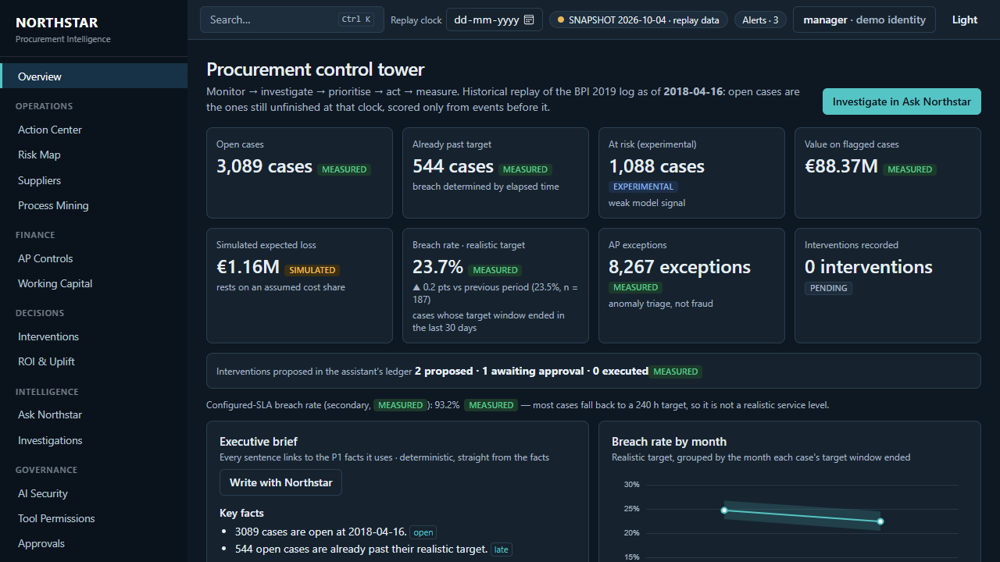
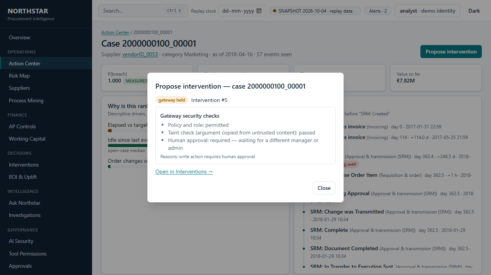
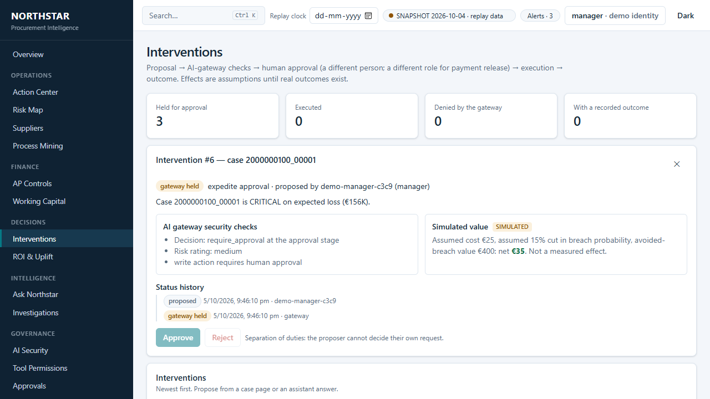

# Northstar Console

The single product UI over three services: **P1** `operations-performance` (analytics, replay clock, models, AP controls),
**P2** `operations-assistant` (evidence-grounded copilot, investigations, intervention ledger) and **P3**
`llm-security-gateway` (the only path from the UI to AI and to actions). One screen to *monitor → investigate → prioritise →
act → measure*, with every number labelled by how it was produced.



## 60-second quickstart (Windows)
```powershell
npm install
powershell -ExecutionPolicy Bypass -File scripts\dev.ps1 -Ollama   # P1 :8000, P2 :8001, P3 :8002 (local throw-away secrets)
npm run dev                                                        # console http://localhost:5173
```
Click **Sign in (demo)** in the top bar and pick a role. `-Ollama` makes P2 answer with a local [Ollama](https://ollama.com) model
(free, weak, every answer labelled `ollama:<model>`); without it, and without a key, P2 returns labelled template answers. Set
`ANTHROPIC_API_KEY` in your own environment for real ones (spend is capped by P2's guard). P1 serves its committed snapshot
unless you set `P1_REAL_DB=1`. `-Fresh` starts with empty state, `-Stop` stops only what the script started (it checks that a
recorded process is still a uvicorn before stopping it); a run's state is in `.dev-state\` and its logs in `.dev-logs\`, both
ignored by git, so it never touches the other repositories' data.

## What is in it
Overview (KPIs with provenance, executive brief traced to facts, breach trend with 95% bands, risk funnel, risk × value, where
time goes, control health, confidence panel) · Action Center (expected-loss queue, filters, natural-language filter box, bulk
investigate) · Case 360 (drivers, timeline with idle gaps, AP exceptions, ask, propose) · Suppliers (Wilson intervals, ranked by the
lower bound, quadrant) · Risk Map · Process Mining (stage/activity graph; median/P75/P90/breach contribution) · AP Controls
(C6 shown **not valid**) · Working Capital (discount slider labelled as an assumption) · Interventions (review/approval with
separation of duties, status timeline, outcome entry) · ROI & Uplift (model vs rules vs random) · Ask Northstar and Investigations
(claim-level support marks, evidence drawer, Markdown/PDF export) · AI Security, Tool Permissions, Approvals, **Attack Lab**
(live step timeline, defenses on/off), Audit Log · Observability (one trace across gateway → assistant → P1 → model, with cost) ·
Model Health, Data Quality, Lineage, Architecture · Experiments (failed, leaked and tied results included) and Evidence &
Limitations. ⌘/Ctrl-K opens a command palette; the replay-clock date picker re-queries everything.

## The demo story (also a test)
`e2e/story.ts`: Overview → at-risk count → queue → case → "Why is this at risk?" (P2 via P3, evidence drawer) → Propose → the
gateway holds it → switch to a manager (a different demo user) → approve → the proposer cannot approve their own → audit log →
Overview ledger count moves. Frames: `docs/demo/`. It runs against recorded data in CI (`npm run e2e:fixtures`) and against the real
local stack (`npm run e2e:live`; with P1 on its snapshot the final execution step may read "execution failed" because P1's ledger
needs a database — the story accepts that in live mode and says so).

| | |
|---|---|
|  |  |

## Quality bars, measured
- Type-check clean; 26 unit tests (Vitest, including that every workflow action is pinned to a commit SHA) and 22 Playwright tests on recorded data (demo story, provenance on every KPI,
  snapshot state, replay clock, loading/empty/error states, command palette, **axe: no serious/critical violations on 15 pages**,
  **no horizontal scroll at 375 px**) plus the same story on the live stack. The live run (P1 snapshot, P2 on a local Ollama
  model, current P3) also checks that the audit log shows the manager's approval as the gateway recorded it.
- **Contracts.** `openapi/p1|p2|p3.json` are pinned copies of what each service publishes. CI regenerates the typed clients and
  fails if `src/api/generated` differs, and `node scripts/sync-specs.mjs --check` fails if a pinned copy differs from the service's
  `main` (`--local` compares with sibling checkouts; run without `--check` to update). P3 also fails its own build on a breaking
  change to its spec, and tests that its committed spec is what the app publishes.
- Lighthouse on the production build (`npm run lighthouse`), Edge: **accessibility 100 and best-practices 100 on all five pages
  tested; performance 73–90**, so the 90 bar is met only on Process Mining (90) and missed on Action Center (89), AI Security (86),
  AP controls (75) and the overview (73) — the cost is ECharts' script evaluation
  under Lighthouse's 4× CPU throttle. Charts are lazy-loaded and the graph series is its own chunk; layout shift is 0. Not hidden:
  `lighthouse-reports/summary.json`.
- Every API number renders a provenance badge (measured / simulated / experimental / pending) with source and n in the tooltip.

## Honest deviations from the brief
- **Drivers, not SHAP**: the early-warning GRU has no SHAP, so Case 360 shows *descriptive* drivers (elapsed vs target, idle time,
  order changes) labelled as such, not a SHAP waterfall.
- **Playwright runs on the installed Edge** (`PW_CHANNEL`), so nothing is downloaded locally; CI installs Chromium. Video needs
  `npx playwright install ffmpeg` (opt-in), so the story is committed as storyboard frames instead of a GIF.
- The audit log merges the gateway's records (including who approved or rejected a held action, in what role) with P2's intervention
  history, joined by trace id. P1's own intervention log is not merged: it needs P1's database, which is not part of the local
  stack, and the records are not yet written to one shared store.
- Typed clients are generated from `openapi/p1|p2|p3.json` (`npm run gen:api`) for paths and requests; P1's responses are free-form
  JSON, so response shapes are hand-written in `src/api/types.ts`.
- The services are separate processes joined by configuration; the stack is not yet deployed (see the cloud notes in P4).

## Cloud (written, not applied)
`Dockerfile` (unprivileged nginx on 8080, security headers, `/healthz`) and `.github/workflows/deploy.yml` (manual dispatch,
workload identity federation, no-ops until the repository variables exist). Neither has been built or run: the machine that
wrote them has no working Docker daemon, and nothing here calls GCP. In the cloud the **gateway is the only public API**: build the
console with `VITE_P3_URL=<gateway>` and `VITE_P1_URL=<gateway>/v1/data` (the gateway's read-only, allow-listed passthrough to P1).
Infrastructure changes (a console Cloud Run service, spend counters, a decision-log sink) belong in `northstar-infra` and need
its Terraform toolchain to verify; they are described in `docs/cloud.md` rather than committed unverified.
