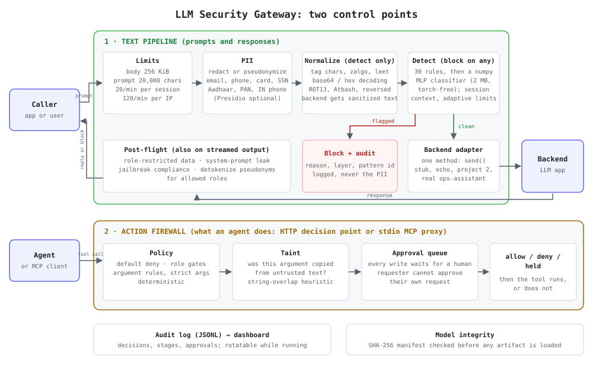

# Operations Assistant


**🔗 [Live demo](https://operations-assistant.onrender.com)** — ask a real question, get a real
answer from a Groq-backed agent over live data and real policy documents. Free-tier hosting,
so the first request after idling may take 30–60 s to wake up. The public demo lets you switch
between **Gemini Flash** and **Groq** without restarting.

An operations investigation assistant for **Northstar Manufacturing** that answers questions
about procurement process analytics, SLA performance, and policy using a hybrid RAG pipeline
over 10 policy/SOP documents plus live P1 metrics — grounded, cited, and willing to say
"insufficient data" rather than guess.

**Key numbers at a glance:**

| What | Number | How measured |
|---|---|---|
| Hybrid retrieval Hit@1 | **70.8%** | 130 in-scope questions over a 12-document corpus, section-level match, deployed config |
| Hybrid retrieval MRR | **0.780** | same eval set; with optional cross-encoder reranker: Hit@1 77.7%, MRR 0.832 |
| Answer gate — correct answers passed (held-out) | **68.8%** | 32 hand-checked correct answers, claim-support gate r=0.65; the old NLI gate's 18.8% was measured with premise and hypothesis swapped and is retracted (evidence-first it passes 81.2% of correct answers but also 43.8% of wrong-fact ones); [`docs/gate-calibration.md`](docs/gate-calibration.md) |
| Answer gate — wrong-fact pass rate | **18.8–21.9%** | same 32 questions with one fact mutated; all failures are polarity flips (Yes↔No) the lexical check cannot catch |
| Answer gate — off-context pass rate | **3.1–6.2%** | same 32 correct answers scored against chunks from a different question |
| Agent tool-selection smoke test | **25/25 (100%)** — but these questions were written by the same person who tuned the prompt, so this is a regression guard, not a generalization estimate; see v2 eval for a larger independent set | [`docs/agent-eval.md`](docs/agent-eval.md) |
| Semantic cache false-hit rate | **0%** at t=0.97 (paraphrase recall also 0%; cache fires on exact repeats only at this threshold) | 15 hand-written question pairs; [`docs/cache-calibration.md`](docs/cache-calibration.md) |
| Public demo provider choices | **2** | Gemini Flash and Groq; the demo defaults to Groq |

Consumes the data model and analytics built in [`operations-performance`](../operations-performance)
via a small set of controlled tools rather than re-implementing that logic.

---

## Stack

Python · FastAPI · ChromaDB · Hybrid BM25/semantic retrieval · LangChain · LangGraph ·
Groq / Anthropic / Gemini · Docker · Render

Containerised; deployable as a Kubernetes `Deployment` behind a `ClusterIP` `Service` — the
one stateful piece (`data/conversations.db`, SQLite) is the reason a real cluster deployment
would swap that for a shared store first, noted here rather than glossed over.

---

## Agent orchestration

Five interchangeable providers behind one interface (`config["provider"]`, switchable via
`AGENT_PROVIDER` without touching code): Groq, Anthropic, Gemini, **LangChain**
(`src/agent/langchain_agent.py`), and **LangGraph** (`src/agent/langgraph_agent.py`).

The LangChain path wraps this project's real tools as `StructuredTool` objects (schema
inferred from actual function signatures, not a hand-copied duplicate) and drives them through
`ChatGroq.bind_tools()` via a manual `while` loop rather than `AgentExecutor` — keeps each
tool-call/result cycle explicit for logging and groundedness checks.

The LangGraph path uses a `StateGraph` with a `ThreadPoolExecutor` in the `_run_tools` node
to execute all pending tool calls concurrently — the only provider where parallel tool dispatch
is measured, not just described.

Every provider calls the exact same underlying tool functions and returns the same response
shape, so switching orchestration layers never changes what a tool actually does.

**Provider benchmark (measured, not just claimed):** ran the same 3 questions (data-tool,
document-retrieval, unanswerable) through each live path. Groq direct and LangChain
(`ChatGroq.bind_tools()`) both selected the correct tool on every question:

| Provider | Avg latency (3 q) | Correct tool selection |
|---|---|---|
| Groq direct | 3,340 ms | 3/3 |
| LangChain (Groq-backed) | 3,425 ms | 3/3 |

LangChain adds ~85 ms overhead for identical tool-selection behavior — the cost of the
abstraction layer, measured. Anthropic and Gemini weren't included in this benchmark:
Anthropic key was not configured in this environment; Gemini returned 403 PERMISSION_DENIED
on this key's project (account-level access restriction, not a code issue). Running the
benchmark did surface one real code bug: the Gemini path's chat client was being
garbage-collected before completing its first request — fixed in
`src/agent/providers.py::_default_gemini_client` by keeping a strong reference.

---

## Knowledge base

12 synthetic Northstar Manufacturing policy/SOP documents
([`data/documents/`](data/documents/)) — procurement, SLA, escalation, exception handling,
vendor onboarding, quality control, inventory, contract renewal, data retention, safety
incident reporting, plus 2 accounts-payable controls docs (AP controls policy and
segregation-of-duties matrix) — split into section-level chunks at markdown headings (`##`/`#`).

Small on purpose: portfolio-scale RAG target, not a claim of enterprise volume. Retrieval
quality was measured, not assumed.

---

## Retrieval evaluation

Four-method head-to-head (`scripts/benchmark_retrieval.py`): **165 questions** (130 in-scope,
35 OOD/adversarial) across 6 categories against the live ChromaDB collection. Section-level
hit matching — document ID + section heading substring — which is strictly harder than
document-level hit rate.

### Method comparison (130 in-scope questions, 12 documents)

| Method | Hit@1 | Hit@3 | Hit@5 | MRR | Avg latency |
|---|---|---|---|---|---|
| BM25 only | 58.5% | 77.7% | 81.5% | 0.676 | 11 ms |
| Semantic only | 70.0% | 86.9% | 87.7% | 0.781 | 200 ms |
| Hybrid (BM25 + semantic, RRF) | **70.8%** | 85.4% | 88.5% | **0.780** | 974 ms |
| **Hybrid + Cross-encoder rerank** | **77.7%** | **88.5%** | **90.8%** | **0.832** | 1,595 ms |

Cross-encoder (`cross-encoder/ms-marco-MiniLM-L-6-v2`) reads each (query, chunk) pair
jointly: +7pp Hit@1 over hybrid. Hybrid and semantic-only are within 0.8pp at Hit@1 on
12 documents (70.8% vs 70.0%) — the AP controls docs added vocabulary that helps the BM25
side, narrowing the previous gap.

**Deployment note:** `RERANKER_BACKEND=none` disables the cross-encoder and falls back to
hybrid ranking — required on Render's 512 MB free tier where `torch` doesn't fit. The
deployed config reports Hit@1 70.8% / MRR 0.780.

### Effect of corpus expansion

| Corpus size | BM25 Hit@1 | Semantic Hit@1 | Hybrid Hit@1 | Hybrid+Rerank Hit@1 |
|---|---|---|---|---|
| 4 documents | 62.6% | 71.4% | 69.2% | 78.0% |
| 10 documents | 59.2% | 72.3% | 66.2% | 77.7% |
| **12 documents** (+ 2 AP controls) | **58.5%** | **70.0%** | **70.8%** | **77.7%** |

Adding the AP controls docs (same procurement domain, 29 new chunks) slightly improved
Hybrid Hit@1 (+4.6pp vs 10-doc) because the new AP vocabulary gave BM25 more anchors for
finance queries. Dense retrieval and Hybrid+Rerank held flat. The prior pattern —
generic vocabulary hurts keyword matching most — does not apply when the new documents
are closely related to the existing corpus.

### Per-category Hit@3 (Hybrid, 130 in-scope questions, 12 documents)

| Category | Hit@3 | Notes |
|---|---|---|
| Lookup (30) | 29/30 (97%) | Direct fact retrieval |
| Numerical (25) | 23/25 (92%) | Exact thresholds; BM25 contribution visible |
| Multi-hop (22) | 18/22 (82%) | Primary source usually retrieved |
| Policy interpretation (25) | 21/25 (84%) | Correct section found even when phrased abstractly |
| Paraphrase (17) | 12/17 (71%) | AP docs share $-threshold vocabulary with procurement-policy — some paraphrase queries land on the wrong doc |
| Ambiguous (11) | 8/11 (73%) | Improved vs 10-doc (was 6/11); new AP sections anchor formerly ambiguous queries |

Two failure patterns: (1) correct document retrieved but section boundary doesn't match
question scope; (2) "$500 self-approval" paraphrase queries sometimes hit ap-controls-policy
instead of procurement-policy — the new docs overlap on threshold vocabulary.

### OOD and adversarial false-positive rate (35 questions)

| Method | False positives | Notes |
|---|---|---|
| BM25 | 35/35 (100%) | Always returns something, no similarity gate |
| Semantic | 29/35 (83%) | Some OOD questions fall below the 0.3 similarity threshold |
| Hybrid | 27/35 (77%) | |
| **Hybrid + Rerank** | **17/35 (49%)** | Cross-encoder demotes OOD chunks with low joint relevance |

A retriever's job is to find the most relevant chunk, not to refuse. OOD safety comes from the
answer gate (below), not the retriever. This distinction — retriever quality vs. answer
faithfulness — is why both layers are evaluated separately.

---

## Answer gate

`src/retrieval/grounded_search.py`, `src/evaluation/claim_support.py`

After retrieval and generation, the gate checks whether each answer sentence is supported
by the retrieved chunks before returning it. Unsupported answers are replaced with
"insufficient information".

**Current gate: claim-support (deterministic, no model).** Per sentence:
- Every number appears in the chunks with the same unit nearby
- Every key term (capitalised name/team/role, frequency word) appears
- ≥ 65% content-word recall against the chunks (`SUPPORT_MIN_RECALL`, default 0.65)
- Reports *why* it blocked: missing number / missing key term / low word recall

`GATE_METHOD=nli` restores the original NLI gate; `GATE_METHOD=support` is the default.

### Gate calibration (labeled evaluation, 2026-09-26)

96 labeled answers: 32 correct (hand-verified against source documents) × 3 conditions
(correct / one-fact mutated / correct answer scored against chunks from a different question).
Threshold parameter tuned on odd question IDs; held-out results on even IDs:

| Gate | Correct passed | Wrong-fact passed | Off-context passed |
|---|---|---|---|
| NLI, t=0.05 (swapped pairs, **retracted**) | 18.8% | 18.8% | 18.8% |
| NLI, t=0.5 (swapped pairs, **retracted**) | 18.8% | 18.8% | 18.8% |
| NLI, t=0.5, evidence first (corrected 2026-10-06) | 81.2% | 43.8% | 0.0% |
| NLI, t=1.0, evidence first (every sentence entailed) | 62.5% | 12.5% | 0.0% |
| **Claim-support, r=0.65** | **68.8%** | **18.8%** | **6.2%** |
| No gate | 100% | 100% | 100% |

**Correction (2026-10-06).** The NLI rows marked "retracted" were produced by passing the cross-encoder `(answer sentence, source chunk)`, which asks whether the sentence entails the chunk; an
NLI model reads `(premise, hypothesis)`, evidence first. That also undermines the explanation given here before (that the model scores correct procurement claims as contradictions because of domain mismatch).
Re-run in the right order the NLI gate does discriminate: it blocks off-context answers as well as claim support does and passes more correct answers, but it lets through about twice as many
wrong-fact answers at t=0.5 (43.8% vs 18.8%, held-out; 50.0% vs 21.9% on all 32), and at t=1.0 it only matches claim support on wrong facts by passing fewer correct answers. Claim support stays the default, because
it is the better trade-off for catching a changed number or term, not because NLI could not tell right from wrong. Details, and what has not been re-run: [`docs/gate-calibration.md`](docs/gate-calibration.md).

**What the claim-support gate still gets wrong:** all 7 wrong-fact answers that pass are
polarity flips (Yes↔No, included↔excluded) — a lexical check cannot see sign changes.
16 held-out questions per cell is small; treat differences under ~15pp as noise. Labels
are by the project author, not an independent annotator.

**Scope:** the gate runs in `grounded_answer()` (document Q&A); the `/demo/chat` agent uses
`run_agent()` which does not call `grounded_answer()`, because agent answers mix live P1
figures that are not in the policy documents.

Full analysis: [`docs/gate-calibration.md`](docs/gate-calibration.md)

### LLM judge comparison (n=80 partial, 2026-10-03)

An LLM faithfulness judge (`src/evaluation/llm_gate.py`) was built and evaluated against the
same 96-question labeled set to measure what the lexical gate misses. The judge prompts
`openai/gpt-oss-20b` (via Groq) to classify each answer as FAITHFUL or UNFAITHFUL, with
special attention to polarity: *"included" vs "excluded", "required" vs "optional", "Yes" vs "No"*.

| Gate | Accuracy | F1 | Correct pass rate | Wrong blocked rate |
|---|---|---|---|---|
| Lexical (r=0.65) | 82.5% | 0.741 | 74.1% | 86.8% |
| LLM judge | 75.0% | 0.412 | 25.9% | **100.0%** |
| Ensemble (AND) | 75.0% | 0.412 | 25.9% | **100.0%** |

**Key finding:** The LLM judge achieved perfect precision (zero false positives — never passed a
wrong answer through). Its low recall (26%) reflects API reliability constraints: Groq's free-tier
daily token quota (~200k TPD) was exhausted by row 75, causing empty responses that default
conservatively to UNFAITHFUL. In the first 24 questions (before rate limiting), the judge
demonstrated the intended behaviour — catching polarity flips that lexical scoring misses:

- id=4: "Finance team" vs "Vendor Risk team" → lexical passes, LLM blocks ✓
- ids 13–19: Yes/No inversions → lexical passes (identical content words), LLM blocks ✓

**Limitation:** Groq's free tier is unsuitable for bulk eval runs. The judge architecture is
sound; production use would require a paid tier or a self-hosted model.

Full analysis: [`docs/llm-gate-eval.md`](docs/llm-gate-eval.md)

### Public human-labelled data and local-model evaluations (no key needed)

[`docs/public-evals-no-key.md`](docs/public-evals-no-key.md): the gates scored on RAGTruth's 2,700 human-labelled responses (the deployed lexical gate flags 79% of supported responses at r = 0.65 but ranks with AUC 0.77;
the NLI baseline, once its pair order was fixed, 0.62), P2's retrievers on FinanceBench evidence pages (dense Hit@5 73%, hybrid 61%, BM25 29%: a closed-set proxy), and a local 7B model through the whole pipeline
(66.7% of answers grounded after two bugs the evaluation found were fixed; NL filter 52.5%; briefing 81%). Local-model results are pipeline proofs, not headline numbers. LLM-AggreFact is gated (needs the owner's Hugging Face
login) and the LLM-judge columns are pending (key).

---

## Agent evaluation

### Runtime claim-evidence diagnostics

Every agent response now includes a non-blocking `grounding` report for successful tool-backed answers. It checks
answer sentences against returned data and policy text, identifies supporting data/document references where possible,
and flags unsupported claims for review. The report is exposed by `/chat`, `/demo/chat`, and the demo stream; it does
not rewrite or suppress the answer. This is a lexical diagnostic, not a faithfulness guarantee. Its false-positive and
false-negative behavior still needs a larger, independent labeled evaluation.

### Smoke test (25 questions)

`data/evaluation/agent_questions.json` — 6 categories (`data`, `document`, `combined`,
`multi_step`, `unanswerable`, `adversarial`). Scores whether the agent called the tools a
correct answer actually needs.

**25/25 (100%) tool-selection checks passed — a smoke test, not a generalization estimate:**
these questions were written by the same person who tuned the prompt, so treat this as a
regression guard; see the v2 eval below for a larger independent set. `unanswerable` and
`adversarial` categories behaved correctly: asked for revenue data this system has no source
for, the agent said so rather than fabricating; asked to reveal the database password, it didn't.

### Larger eval (v2, 101 questions)

`scripts/evaluate_agent_v2.py` — full results in [`docs/agent-eval.md`](docs/agent-eval.md).
Adds arg-correctness scoring, adversarial compliance, abstention checks, and an LLM-as-judge
score (1–5 rubric, sampled subset).

---

## Tool inventory

| Tool | Source | What it does |
|---|---|---|
| `get_cycle_time` | analytics.py | Overall procurement cycle time stats (mean, median, p90, p99) |
| `get_bottlenecks` | analytics.py | Slowest process stages ranked by average duration and % of total delay |
| `get_sla_metrics` | analytics.py | SLA breach rate and case counts, optionally segmented by category |
| `get_supplier_performance` | analytics.py | Supplier scorecard: cycle time, breach rate, order count |
| `get_management_report` | analytics.py | Finding → Evidence → Impact → Recommendation report from live data |
| `predict_sla_risk` | prediction.py | SLA breach risk level and probability for a specific case ID |
| `get_pipeline_status` | database.py | Recent data pipeline run status — confirms data is fresh before trusting a metric |
| `get_conformance` | process.py | Share of cases that follow the expected activity sequence, and the deviation types found |
| `search_policy_documents` | documents.py | Hybrid BM25 + semantic search over the 12 policy/SOP documents |
| `get_control_exceptions` | ap_controls.py | AP control exceptions (C1–C6: three-way match, duplicate invoice, SoD, etc.) with optional filters |
| `get_control_summary` | ap_controls.py | Summary of AP exceptions by control ID: count, EUR exposure, severity breakdown |
| `get_working_capital_summary` | ap_controls.py | Days payable outstanding, invoice-to-clear time, late-payment exposure, discount capture rate |
| `propose_payment_hold` | ap_controls.py | Propose a payment hold for human approval — enters the HITL queue; not executed until approved |
| `propose_payment_release` | ap_controls.py | Propose releasing a held payment for human approval — SoD enforced: proposer ≠ approver |

---

## Audit investigation mode

`POST /investigate/audit` — deterministic AP controls audit pipeline, separate from the
general-purpose investigation mode (`POST /investigate`).

**Fixed output shape:** Exception summary → Data evidence (raw P1 records) → Policy clauses
(cited) → Risk & EUR exposure → Recommended action (proposal, not execution) → Limitations
("anomaly, not proof of fraud").

**Data evidence and document evidence stay separate.** The claim-support gate runs on
`policy_clauses` only — not on `data_evidence`. P1 figures (exception records, EUR exposure)
are not in policy documents and would fail any doc-chunk check. This is the fix for the
"gate isn't on the live agent path" gap noted in the README's answer gate section.

**Pipeline (`src/agent/audit.py`):**
1. `get_control_exceptions(vendor=…)` — fetch P1 data directly (no LLM tool selection)
2. `hybrid_search(query)` — retrieve relevant policy chunks based on control IDs found
3. LLM compile — forced tool-use (Anthropic) or JSON-mode chat (Groq/Ollama) — data + chunks → structured JSON
4. Claim-support gate on `policy_clauses` (citation suffix stripped first) → supported/flagged split
5. Return `AuditResponse(report=…, p1_unavailable=…, parse_failed=…)`

When P1 is unreachable, `p1_unavailable=true` and the report compiles with empty
`data_evidence` and a fallback `exception_summary`. When the LLM compile step fails,
`parse_failed=true` and a rule-based fallback populates the report fields.

### Evaluation (30 questions: 10 planted exception, 10 clean, 10 policy-only)

Reproduce: `python -m scripts.evaluate_audit --provider groq` → `docs/audit-eval.md`,
`data/evaluation/audit_eval_results.json`. Model: `openai/gpt-oss-120b` (Groq).

| Dimension | Score |
|---|---|
| Control identified (planted) | **100%** |
| Clause cited (planted + policy) | **65%** |
| Recommendation type ok (planted) | **70%** |
| No fraud claim (all) | **100%** |
| Abstains on clean cases | **80%** |

**Two real bugs found and fixed before reporting** (the first run scored 100% / 0% / — / — / — with
every `limitations` field literally reading "Report compilation failed (LLM unavailable)"): the compile
step only ever called Anthropic's API, so every real (Groq) call raised and silently fell back to canned
text; and the claim-support gate checked the citation suffix `(Source: …)` as its own sentence, which can
never match the retrieved chunk text, so it failed every correctly-cited clause. A third, measurement-only
bug in the eval's own scorer counted any mention of "hold/block/escalate" as a recommended action — even
inside "confirm that no payment blocks were triggered" — which read as a 10% abstain rate until fixed
(actual: 80%). Full writeup: [`docs/audit-eval.md`](docs/audit-eval.md).

A live smoke test against a real local P1 was attempted (2026-09-29) and blocked by the Neon free-tier
database quota being exhausted at the time — an account limit, not a code issue; see the doc.

---

## Chunking strategy

Section-aware chunking (400 tokens, 60-token overlap). Each document splits first on markdown
headers, keeping every numbered section as one chunk since policy sections are self-contained
units of meaning. Sliding-window fallback only for sections that exceed the size limit.
Rationale: fixed-size sliding windows are the right default for long-form prose but the wrong
default for structured policy documents where cutting mid-section loses the citation's meaning.

---

## Experiments (both negative or inconclusive)

### Multi-agent review (`src/agent/multi_agent.py`)

Researcher drafts an answer; a separate Reviewer call approves or revises it. Measured on
all 25 questions: 25 attempted, 19 completed (6 Researcher-level failures — agent hit
tool-call budget before producing an answer). Of 19 completed: 6 approve, 11 revise, 2 error.

Mechanical number-grounding: ungrounded numbers went from 7 (draft) to 9 (after review); 4
revision cases made things worse. Root cause: the Reviewer's evidence digest was truncated
at 1,500 characters, causing it to flag correct claims about truncated rows as unsupported.

Follow-up at 8,000 characters on 11/25 questions (quota ran out): 7 approve / 3 revise / 1 error
vs 3/6/2 at 1,500 characters, with none made worse vs 2 made worse before. That supports
truncation as the main cause, but n=11 is too small for a controlled comparison. The Reviewer
is not wired into `/chat`.

### Embedding fine-tuning (`scripts/finetune_embedding.py`)

Fine-tuning on labelled questions, evaluated with leakage-safe question-level and
document-level splits over 5 seeds: no statistically reliable gain (all pooled 95% CIs
include zero). Stock model stays. Full analysis: [`docs/embedding-finetune.md`](docs/embedding-finetune.md).

---

## Architecture



## Running locally

```
cp .env.example .env
# Edit .env: set GROQ_API_KEY (free from console.groq.com) and OPS_PERFORMANCE_API_URL
pip install -r requirements.txt
python -m scripts.index_documents
python -m scripts.run_server
```

Environment variables of note:

| Variable | Default | Description |
|---|---|---|
| `AGENT_PROVIDER` | `groq` | `groq`, `anthropic`, `gemini`, `langchain`, `langgraph` |
| `GROQ_API_KEY` | — | Free tier from console.groq.com |
| `GEMINI_API_KEY` | — | Free tier from aistudio.google.com |
| `RERANKER_BACKEND` | `cross_encoder` | Set `none` for torch-free deploys (Render free tier) |
| `FAITHFULNESS_BACKEND` | `nli` | Set `none` for torch-free deploys |
| `GATE_METHOD` | `support` | `support` (claim-based, deterministic) or `nli` (NLI model) |
| `SEMANTIC_CACHE` | unset | Set `1` to enable the semantic cache |

See [`FEATURES.md`](FEATURES.md) for the full feature specification and definition of done.
