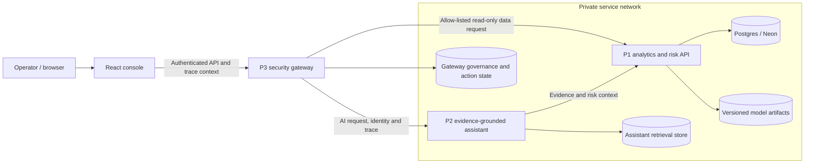

# Northstar architecture

Northstar keeps its UI, performance service (P1), assistant (P2), and security
gateway (P3) as separate deployables. The gateway is the only API the console
uses. The local Compose configuration publishes the console and gateway ports;
P1 and P2 are internal to the Compose network. The cloud topology shown below
is the intended design, not a deployed environment.

## Request and action paths

1. The console sends questions and read requests to P3, not directly to P1/P2.
2. P3 applies identity, rate/quota, prompt/PII, and action-policy checks. It
   forwards allowed AI requests to P2 and exposes only its allow-listed P1 data
   routes.
3. P2 retrieves operational evidence from P1 and the policy corpus, then
   returns grounded answer details and trace context through P3.
4. Write proposals go through the gateway action firewall. A sensitive action
   is held for an authorized human approval; the requester cannot approve their
   own request. The decision is recorded in the gateway audit state.
5. P1 owns event analytics, risk inference, intervention outcomes, and model
   lifecycle evidence. The assistant cannot authorize writes to those systems.

## Environment status

| Environment | Status |
|---|---|
| Local Compose | Configuration is checked into `docker-compose.yml`; local image build and end-to-end runtime still require Docker Engine validation. |
| Cloud | Terraform and deployment workflows are prepared, but infrastructure has not been applied. P1/P2 are intended to remain private; only the gateway API is public. |
| Persistence | Local service state and model/data files are not equivalent to a verified durable cloud store. Do not describe the cloud architecture as live or durable until the deployment and persistence migration are run. |
